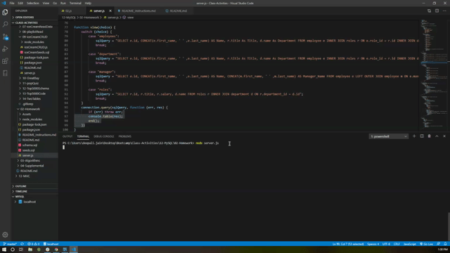
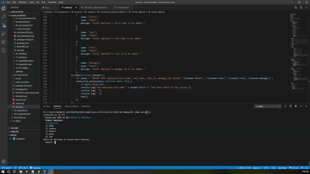
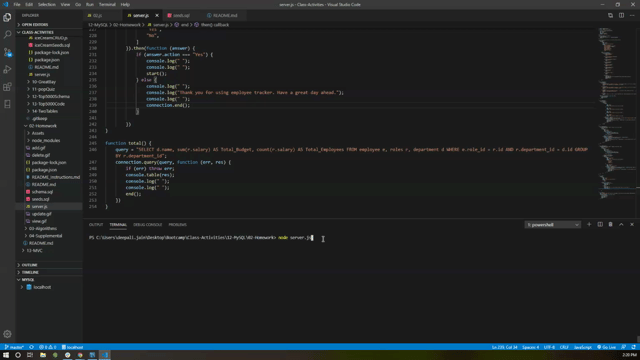

# Unit 12 MySQL Homework: Employee Tracker

Here is an application that allows users to perform the following actions on the database:

  1. View departments, roles, employees

   

  2. Add employees using various criteria

   

  3. Update employee information using various fields

   

  4. Delete employee

   

  5. Total utilized budget of all departments 

   
